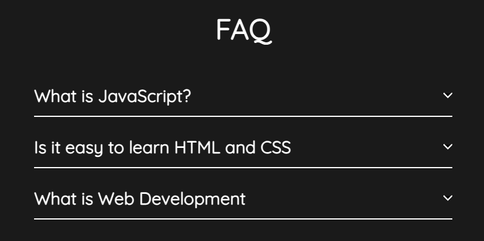

# UI Elements
This repository contains examples of different UI elements that can be used to enhance the user experience for web application.

---

## FAQ
The FAQ (Frequently Asked Questions) component is a helpful and commonly used web component that provides answers to the most common questions. This component is typically used on websites to help users find answers to frequently asked questions related to the products, services or business. The FAQ component provides a simple and easy-to-use interface for users to find answers quickly and easily.

Live link - https://tsimeonov.github.io/UI-Components/faq/

---

## Responsive Mega Menu

A responsive mega menu is a user interface element commonly used in web design to efficiently organize and navigate complex websites or applications. It provides a visually appealing and space-saving way to display a large volume of information, such as navigation links, categories, or content previews.

Live link - https://tsimeonov.github.io/UI-Components/Responsive-mega-menu%20/

--- 

## Simple Responsive menu

A simple responsive menu built with HTML, CSS and JS.

Live link - https://tsimeonov.github.io/UI-Components/Simple-responsive-menu/index.html

---

## Paralax Scrolling

Link to https://tsimeonov.github.io/UI-Components/Parallax%20Scrolling%20Website/
